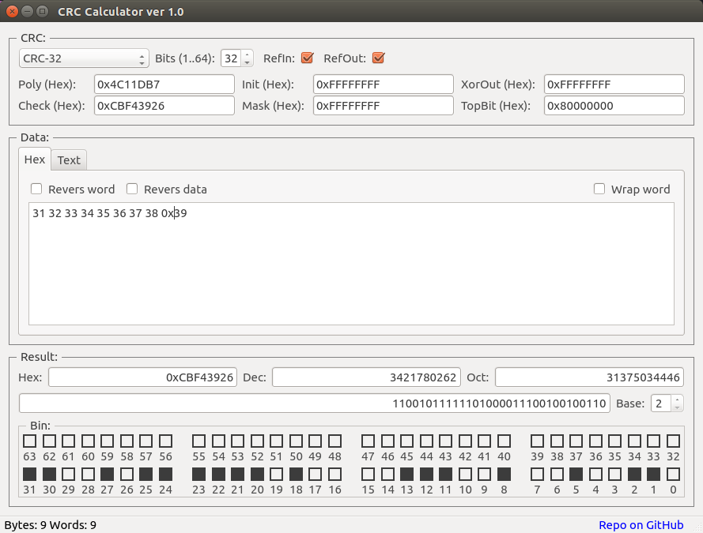
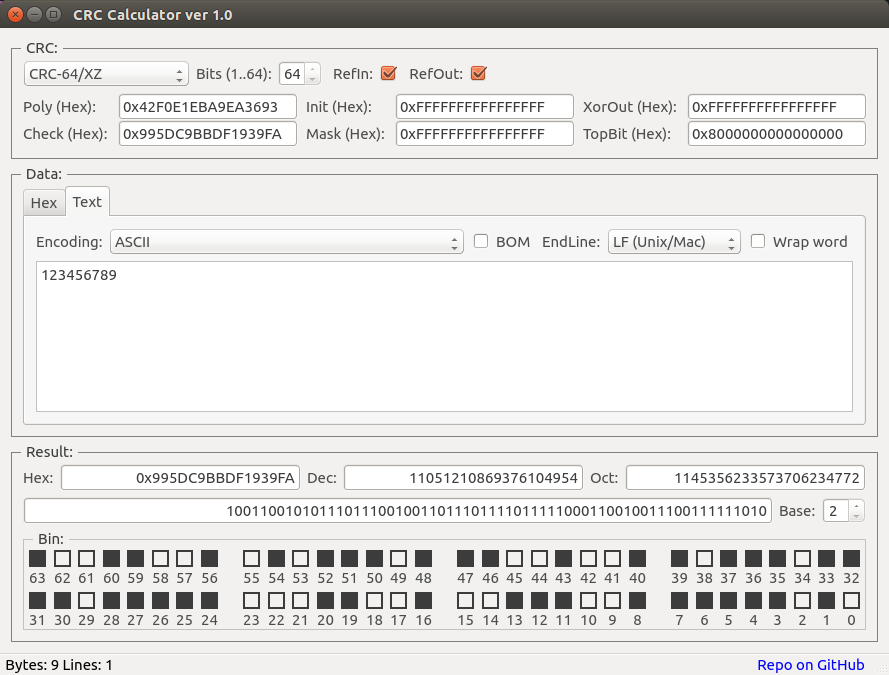
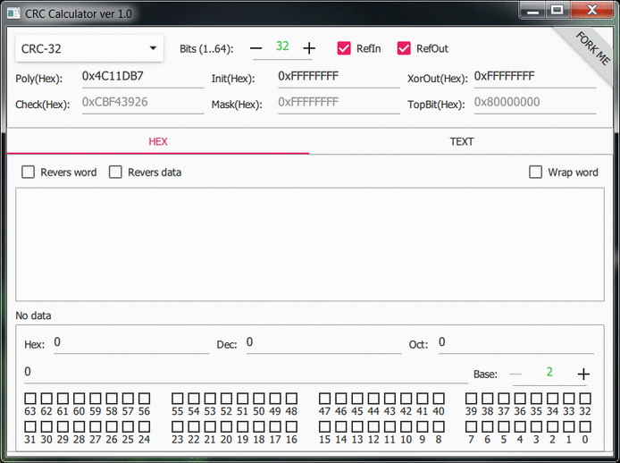

# QModBus is wrapper over libmodbus for Qt

## Description
QModBus is abstract C++ class for Qt. QModBus is wrapper over libmodbus for Qt. 
From this abstract class inherited two specific classes: **QModBus_TCP** and **QModBus_RTU**. 
This class provides the opportunity to work with the library [(libmodbus ver 3.1.2)](http://www.libmodbus.org) in not blocking mode.

</img>

</img>

#59a93cb4c8

***
 
## License

[BSD](./LICENSE).
